# Publishly Website Overview

Publishly is an innovative platform that enables users to register and create personalized profiles for sharing various types of content, including articles, information, and images. Users can engage with the community by sharing their own stories and media, as well as by liking, commenting on, and exchanging ideas and opinion about others' posts.

The platform is designed for individuals who are passionate about writing on diverse topics, fostering an environment of respectful dialogue and meaningful opinion exchange.

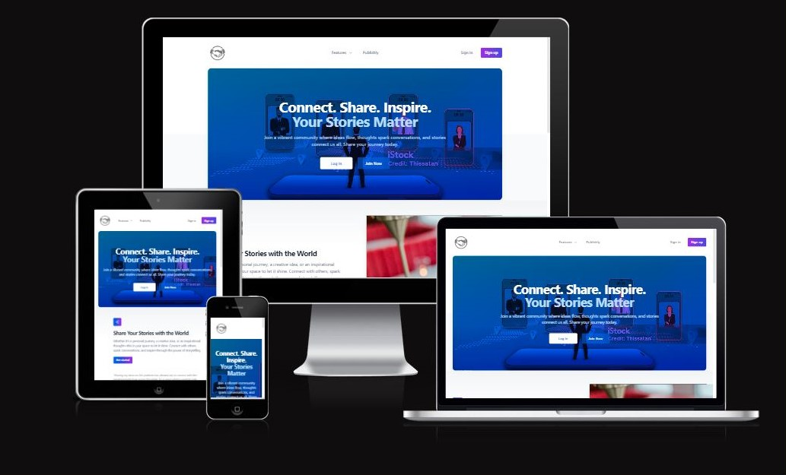

## List of links

- [GitHub Repo Frontend](https://github.com/ROCK3879/publishly_frontend.git)
- [GitHub Repo Backend](https://github.com/ROCK3879/publishly_backend.git)
- [Live Link](https://publishly-46a2edd7f6b7.herokuapp.com/)
- [BACKLOG link](https://github.com/users/ROCK3879/projects/5)

# Overview

Publishly is a dynamic platform that allows users to register and build personalized profiles for sharing a wide range of content, such as articles, insights, and images. It offers an interactive community experience where users can contribute their own stories and media, as well as engage with others through likes, comments, and discussions on shared posts.

Designed for those with a passion for writing on diverse topics, Publishly cultivates a respectful space for exchanging ideas and fostering meaningful conversations.

# Project Goals

The main goals of this project are to:
## Create a Responsive and Interactive User Interface: 
Develop a clean and intuitive UI that works seamlessly across various devices and screen sizes, providing a smooth user experience.
## Implement Core Functionality with CRUD Operations: 
Allow users to create, read, update, and delete posts and comments through an interactive front-end that communicates with the back-end API.
## Utilize Reusable React Components: 
Build the application using React’s component-based architecture, ensuring reusability, maintainability, and scalability for future features or updates.
## Enhance User Experience with Dynamic Content Updates: 
Improve the interactivity of the application by implementing real-time updates (e.g., after deleting a post or comment) without requiring a page refresh.
## Ensure Application Security and Performance: 
Protect sensitive information by following best practices (e.g., using environment variables) and optimize the application's performance through React’s virtual DOM and efficient state management.
## Document Key Features and Design: 
Provide comprehensive documentation that outlines the project’s functionality, design choices, and the benefits of using React.

# Admin stories

## As an Admin, I want to manage user accounts, 

so that I can ensure a safe and respectful environment on the platform.
Actions: Create, update, suspend, or delete user accounts as necessary.

# User stories

## As a User, I want to create an account, 

so that I can participate in the Publishly community.
Actions: Register with email, create a profile, and set privacy preferences.

## As a User, I want to publish articles, information, and images,

so that I can share my ideas and stories with others.
Actions: Create posts, upload images, and tag relevant topics.

## As a User, I want to browse and read other users' content, 

so that I can discover new topics and engage with the community.
Actions: Search for topics, follow other users, and filter content by interest.

## As a User, I want to like and comment on posts, 

so that I can interact with other users and share my thoughts on their content.
Actions: Like and comment.

## As a User, I want to edit or delete my own content, 

so that I can update my posts if necessary.
Actions: Access and modify previous posts, update images, or delete content.

## As a User, I want to manage my account settings,

so that I can control my account preferences.
Actions: Update profile. 

# Features

## Account Registration & Profile Creation: 

Simple sign-up with email, profile customization.
Login & Authentication: Secure login with password.

## Content Creation

Post Creation & Media Upload: Create articles, upload images, and tag relevant topics.
Publish: Save and preview posts and publishing.

## Content Discovery

Search & Filters: Search for posts, authors, and filter by topics or interests.
Explore & Follow: View trending posts and follow users for personalized content updates.

## User Interaction

Likes & Comments: Like and comment on posts with notifications for interactions.
Reply & Discussions: Engage in conversations through comments.

## Content Management

Edit & Delete Posts: Update or remove posts, including text and images.

## Account Settings

Profile Updates: Manage profile details.

## Navigation Bar

The fully responsive navigation bar is available on all pages, ensuring seamless navigation across the platform. It includes key elements such as registration, sign-in, sign-out, and forms, which remain consistent on each page for a unified user experience. This feature enables users to easily move from one section to another, providing an intuitive and efficient way to explore the platform.

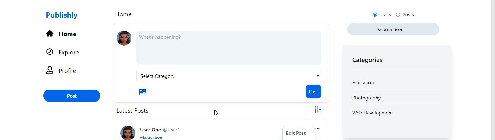

## Home Page

The Home Page serves as the central hub of the Publishly platform, offering users quick access to featured content, popular posts, and the latest updates from the community. Users can easily explore trending topics, discover new articles, and follow active contributors. The home page also highlights personalized recommendations based on user interests, providing a dynamic and engaging experience for both new and returning visitors.

Clear navigation options and a responsive design ensure that users can easily browse and interact with the platform from any device.

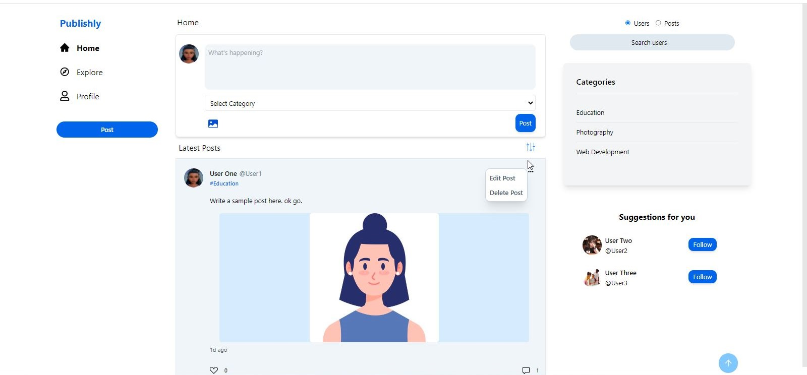

## Explore page

The Explore page is designed to help users discover new and trending content on the Publishly platform. It showcases a curated selection of popular posts, articles, and media from diverse topics, encouraging users to explore beyond their usual interests. Users can browse through various categories, find content by tags, or follow trending discussions within the community.

With powerful search and filtering options, the Explore Page makes it easy to find fresh ideas and connect with new authors and topics, creating an engaging and dynamic user experience.

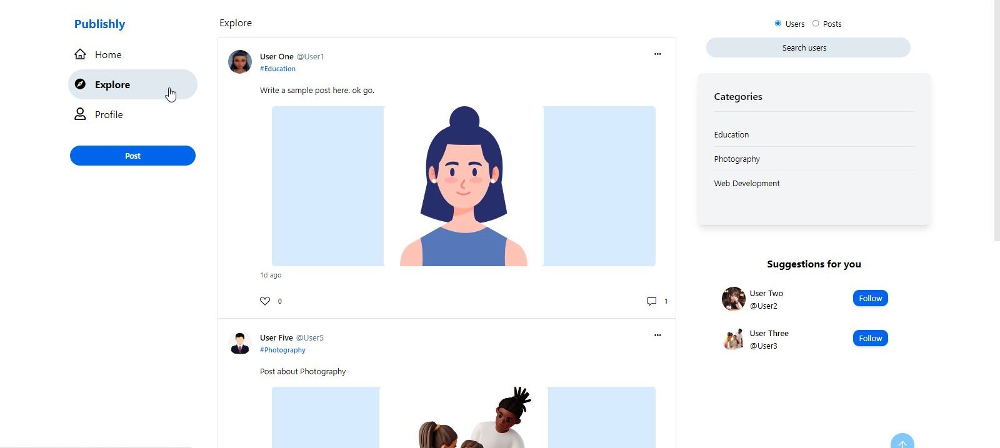

## Profile Page

The Profile Page allows users to manage and showcase their personal information, posts, and interactions on the Publishly platform. It includes a user’s bio, profile picture, and a collection of their published content, such as articles and images. Users can also view their followers, following list, and engagement stats like likes and comments received.

From the profile page, users can edit their personal details, update account settings, and manage privacy preferences. It serves as a personal hub where users can track their activity and easily navigate their contributions to the community.

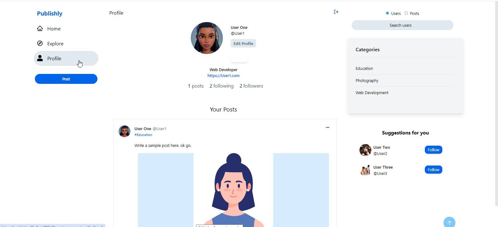

## Admin Home Page

The Admin Home Page serves as the control center for platform administrators, providing quick access to essential management tools. This page features an overview of user activity, including key metrics such as the number of active users and recent registrations.

Admins can easily navigate to quick menu sections users, posts and categories. Additionally, admins can access tools for setting platform guidelines and managing site-wide for users, posts and categories.

With a friendly interface and streamlined navigation, the Admin Home Page empowers administrators to efficiently oversee the Publishly community and ensure a safe, engaging environment for all users.

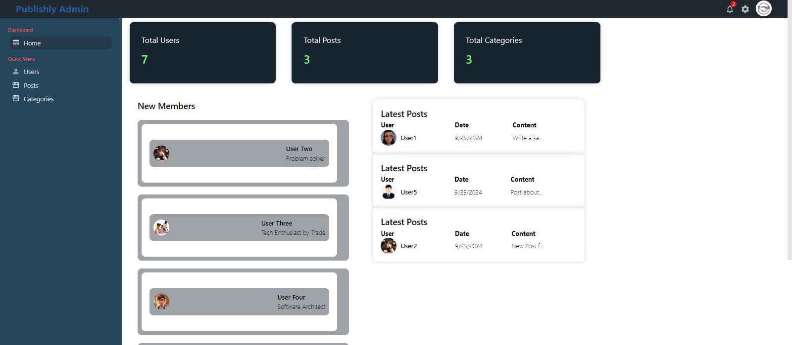

At the end, the admin has the option to log out using the Logout button, which is hidden under the gear icon in the upper right corner of the page.

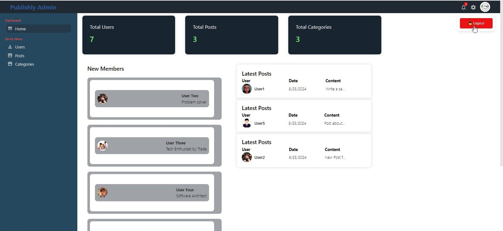

### Admin Quick Menu

The Admin Quick Menu for Users provides administrators with immediate access to essential user management functions. This streamlined menu is designed for efficient navigation and includes the following key options:

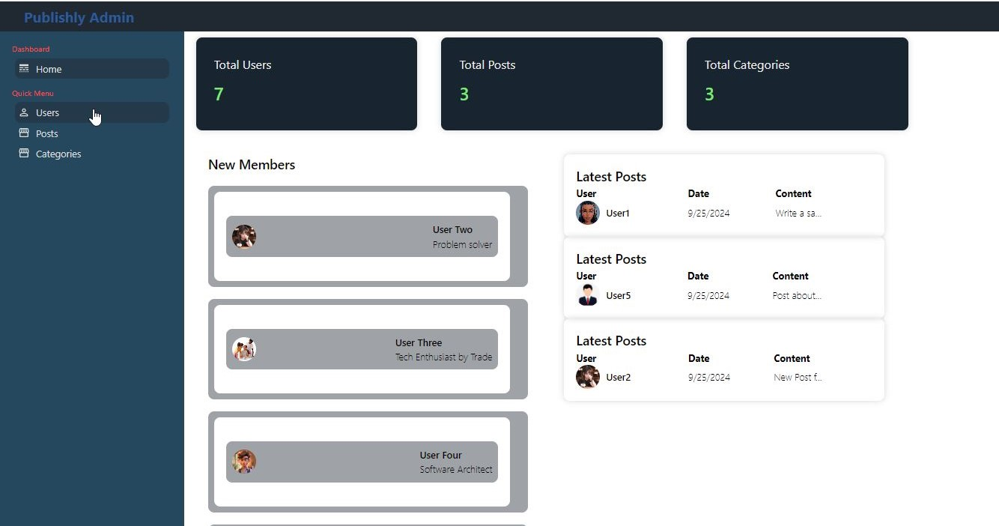

#### View Quick User Page: 

Quickly access a comprehensive list of registered users, edit users info and delete users

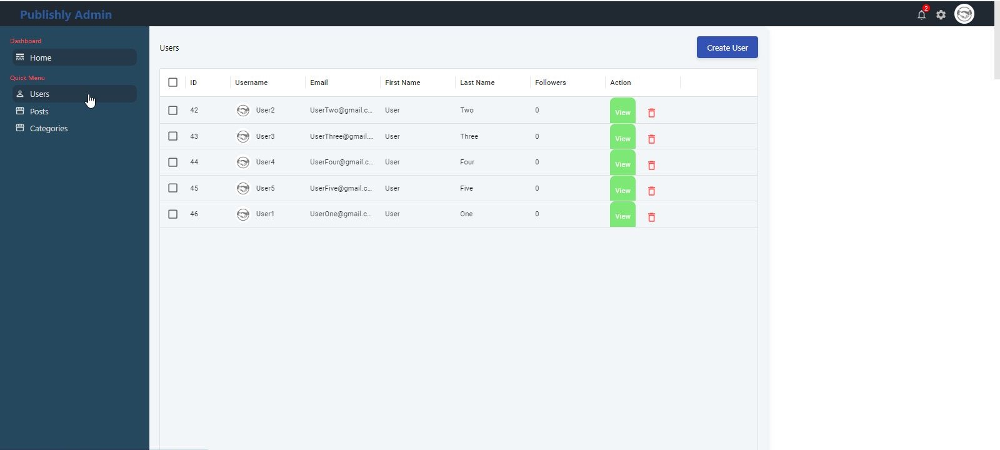

#### View Posts:

The View Posts feature allows administrators to access a comprehensive list of all published content on the platform. This section includes options to: Monitor Posts, Delete Posts and Filter and Search.

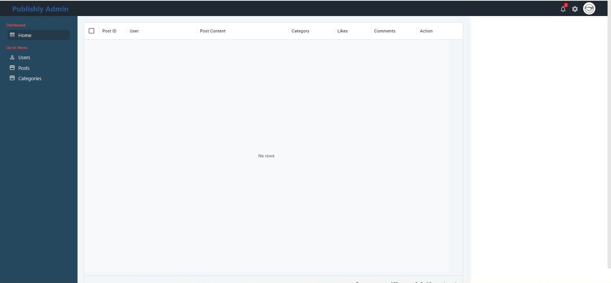

#### View Categories:

The View Categories feature enables administrators to manage the topics under which content is organized on the platform. This section includes functionalities to: Access Category List, Create New Categories, Edit Categories, Update Categories and Delete Categories.

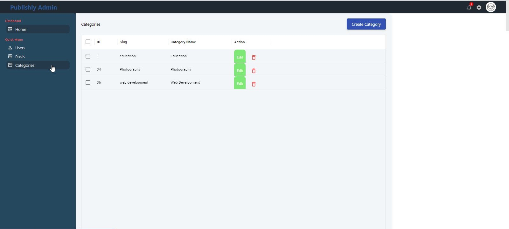

## Join Now and Sign Up

At the center of the home page, there are "Join Now" button and upper right corner there are "Sign Up" button that users can click to access a comprehensive registration form. This form allows users to register by entering their first name, last name, username, email address, and password. A user must confirm their password. The register form examines the right formula of an email. If its formula was not correct, an error message will appear. As a user enters their password, and user confirms their password, the two must be identical. Passwords must meet specific requirements to ensure security. If a user does not fulfill these criteria, an error message will appear, indicating the following requirements: at least one uppercase letter, one lowercase letter, one special character, and one number. At the bottom of this form, there is a Log In link in case the user wants to access the Log In form.

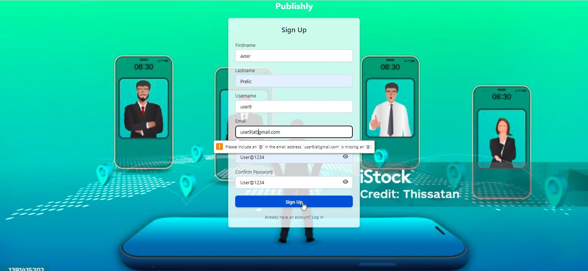

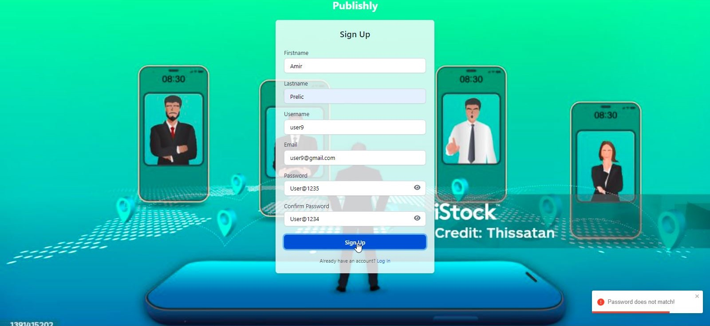

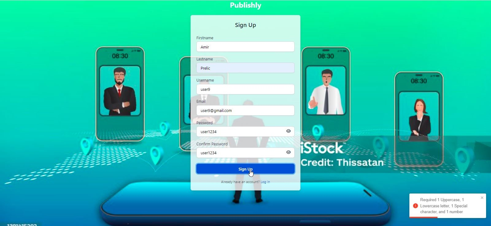

## Log In and Sign In

At the center of the home page, there are "Log In" button and upper right corner there are "Sign In" button that users can click to access a comprehensive sign in form. This form allows users to sign in by entering their email address, and password. The sign in form examines the right formula of an email. If its formula was not correct, an error message will appear. As a user enters their password. The password must also be valid; otherwise, the user will receive an error message indicating that their password does not match the account information.

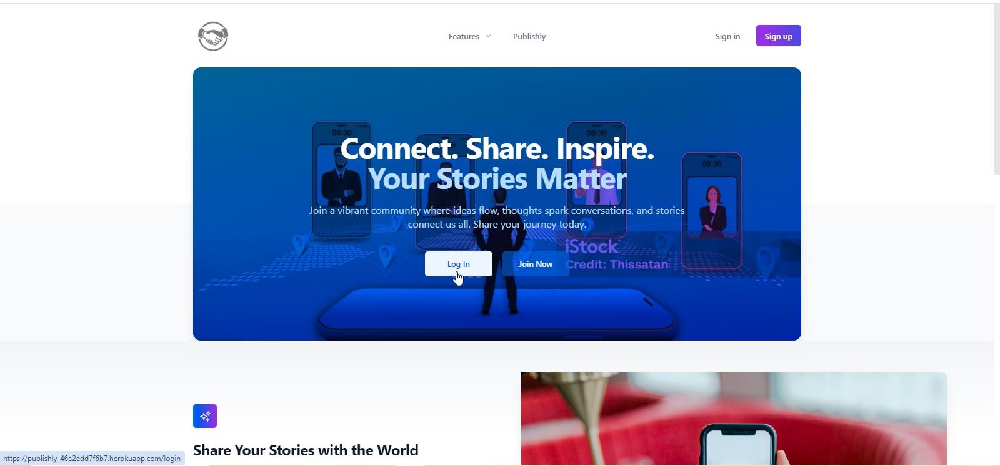

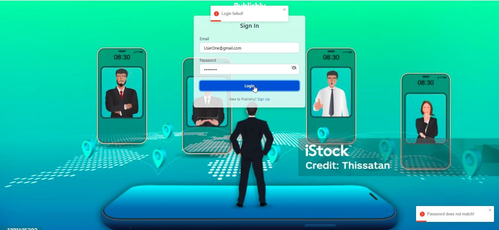

## User Interface Design

The page is divided into three sections: the left side, the center, and the right side.

On the left side, the platform’s name is prominently displayed, along with the navigation menu and a "Post" button. The right side features a search bar that allows users to choose whether to search for users or posts.

Below the search bar on the right side, there is a Category menu where users can select a category in which they wish to participate. At the bottom of the right side, the platform suggests users who may be interesting to connect with; by clicking the "Follow" button next to a suggested user, you can begin following them.

In the center of the page, the upper section includes a window where users can upload an image, select a category, and write text. By clicking the "Post" button, users can publish their desired content.

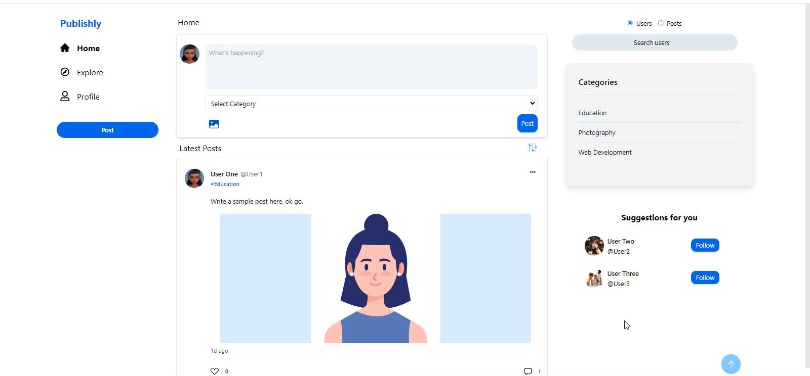

## Admin Interface Design

The Admin Interface Design provides a streamlined and user-friendly experience for administrators managing the Publishly platform. Featuring intuitive navigation and organized sections, this design allows admins to efficiently oversee user activity, manage content, and ensure a safe community environment. The layout includes quick access to essential tools. 
The Home Page of the Admin Interface is divided into two sections: a narrow left side and a wider right side.

The left side contains the Dashboard and Quick Menu, providing easy access to essential administrative functions. In contrast, the right side offers a more comprehensive view of relevant information.

At the top of the right side, there is a visual dashboard displaying key metrics, including the total number of users, posts, and categories. Below this, administrators can review new user registrations and the latest posts, ensuring they stay informed about recent activity on the platform.

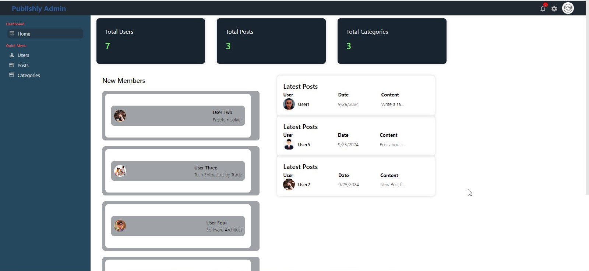

## User Logout button

The Logout button appears on the nav bar under profil button and only after a user will have login.
When a user clicks on the "Logout" button, user will successfully logout and redirect to home page.

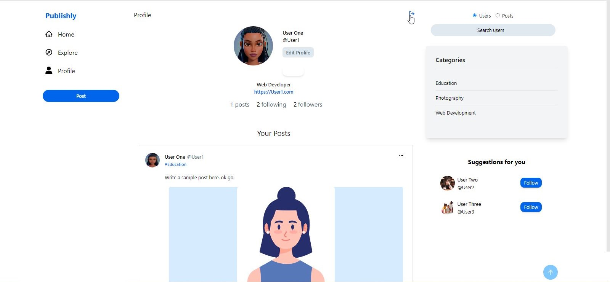

## Admin Logout button

The Logout button appears on the upper right corner under gear button and only after a admin will have login.
When a admin clicks on the gear sign "Logout" button will appear and after click logout button admin will successfully logout and redirect to home page.

# Technologies Used

- Frontend: HTML, CSS, JavaScript
- Backend: Django, Django REST framework
- Database: PostgreSQL

# Typography and color scheme

- Theme_color: #000000
- Background color: #ffffff
- Google font have been used: Roboto.
- Colors have been applied: #0e0e0e, #ffffff, #000000.
- Webkit-box-shadow: #00000023;
- Box-shadow: #00000033;

# Design Documentation

## UI/UX Design Principles
- Consistency: Reusable components ensure a uniform look and feel.
- Responsiveness: The app adapts to various screen sizes for mobile, tablet, and desktop.
- Immediate Feedback: React's state management provides instant updates without page reloads.

## Design Mockups
Include links or images of design mockups or wireframes that represent the application's layout and functionality. This visual representation helps convey the design intent and user flow.

## Responsive Design
The application is built to be responsive, employing CSS Flexbox and Grid layouts to adapt to various screen sizes, ensuring a seamless experience on mobile, tablet, and desktop devices.

# Benefits of React

## Performance
React’s virtual DOM and efficient diffing algorithm significantly improve performance by minimizing unnecessary re-renders. Instead of reloading the entire page, React updates only the parts of the UI that have changed, providing a faster and smoother user experience.

## Component-based Architecture
React’s component-based architecture allows for building reusable, modular components. This promotes code reusability and scalability, as individual components can be easily maintained, tested, and used across different parts of the application without duplicating code.

## Developer Productivity
React enhances developer productivity by simplifying state management and UI updates through hooks like useState and useEffect. Its declarative syntax allows developers to focus on what the UI should look like, while React efficiently handles the rendering, which reduces development time and complexity.

# Reusable React Components
The application is built with a focus on creating reusable React components, which ensures scalability, maintainability, and a cleaner codebase.

## Benefits of Reusability
### Code Maintenance 
Having reusable components reduces code duplication, making the codebase easier to maintain and update.
### Scalability 
Components can be easily reused or extended as the application grows, making development more efficient.
### React Architecture 
This approach aligns with React’s architecture by breaking the UI into small, self-contained components that manage their own state and behavior.

# Wireframes

I used Balsamiq wireframes for my project.

# Entity relationship diagram

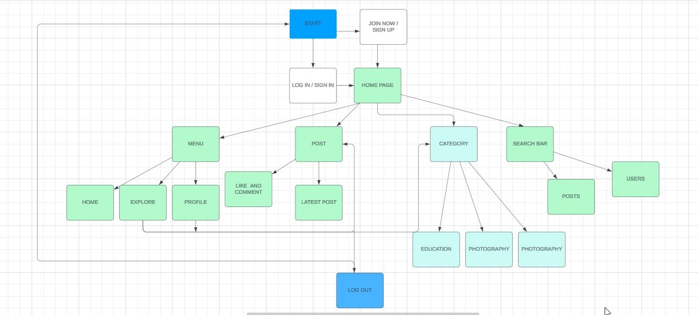

# Technology Overview

## Visual Studio

Visual Studio is a robust development environment I employed for writing, reviewing, integrating, and deploying code.

## GitHub

GitHub is a platform for version control and collaborative software development. I utilized it to create a central code repository and manage the deployment of Publishly platform. This tool allows me to track changes made to the code and revert to previous versions when necessary.

## Heroku

Heroku is a cloud-based platform that enables developers to build, deploy, and scale modern applications seamlessly. Supporting multiple programming languages including Node.js, Ruby, Java, PHP, Python, Go, Scala, and Clojure, Heroku allows developers to focus on code rather than infrastructure. I deployed Publishly platform on Heroku, taking advantage of its seamless integration with GitHub.

## Django & Python

Python is a high-level, general-purpose programming language. Django, a free and open-source Python-based web framework, follows the model-template-views (MTV) architectural pattern. I utilized Django and Python to develop the core functionalities of Publishly platform.

## HTML (HyperText Markup Language)

HTML is the standard markup language for documents designed to be displayed in a web browser. It defines the structure and meaning of web content, making websites accessible and enhancing search engine optimization. I employed HTML to structure the content of Publishly platform.

## CSS (Cascading Style Sheets)

CSS is a style sheet language used for describing the presentation of a document written in HTML or XML. I used CSS to add styling to the HTML templates of Publishly platform.

## JavaScript

JavaScript is a programming language essential for web development alongside HTML and CSS. I utilized JavaScript to enhance the functionality of customer registration, table booking, and cancellation processes for Publishly platform.

## Google Fonts

Google Fonts enhance the visual appeal of websites. I incorporated Google fonts Roboto in Publishly platform.

## W3C HTML & CSS Validators

The W3C provides online tools to validate HTML and CSS code by URL, file upload, or direct input. I used these validators to ensure the HTML and CSS code of Publishly platform adhered to web standards.

## CI Python Linter

The CI Python Linter, an online tool, was used to validate all Python files of Publishly platform through direct code input.

## JSHint

JSHint is an online tool for validating JavaScript code. I used JSHint to ensure the JavaScript code in Publishly platform was error-free and followed best practices.

## Balsamiq Wireframes

Balsamiq Wireframes is a graphical user interface wireframe builder application. It allows designers to arrange pre-built widgets using a drag-and-drop editor. I utilized Balsamiq to create wireframes for Publishly platform.

## Lucidchart

Lucidchart is a web-based diagramming application that facilitates collaborative drawing, revising, and sharing of charts and diagrams. I used it to create the entity relationship diagram for Publishly platform.

## Pexels and Istock

Pexels and IStock is a platforms that provides high-quality and completely free stock photos. I used Pexels and IStock to source and manage visual content for Publishly platform.

## ElephantSQL

ElephantSQL is a PostgreSQL database hosting service that manages administrative tasks such as installation, upgrades, and backups. I utilized ElephantSQL to host the PostgreSQL database for Publishly platform.

## Gunicorn

Gunicorn is a WSGI server that acts as an intermediary between web servers and Python applications. I installed Gunicorn in Publishly platform to deploy the Django application on Heroku.

# Code validation

## HTML

I validated it by means of the W3C HTML validator.
Below is a screenshot that documents this validation.

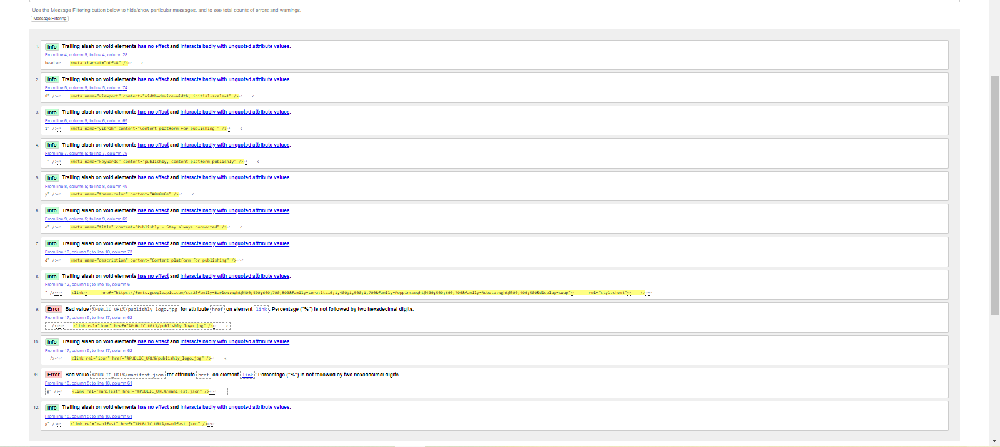

## CSS

I validated it by means of the W3C CSS validator.
Below is a screenshot that documents this validation.

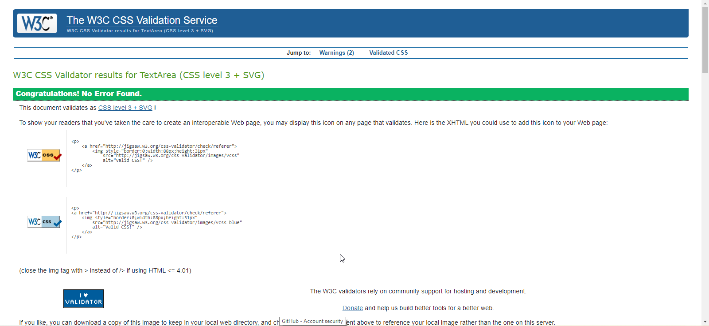

## CI Python Linter

I validated it by means of CI Python Linter.
Below is a screenshot that documents this validation.

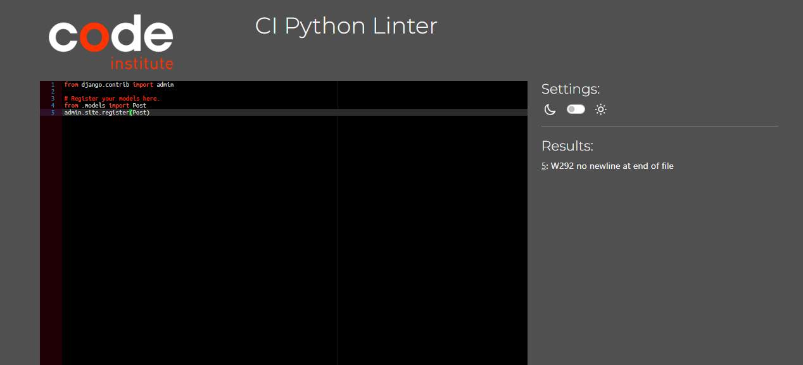

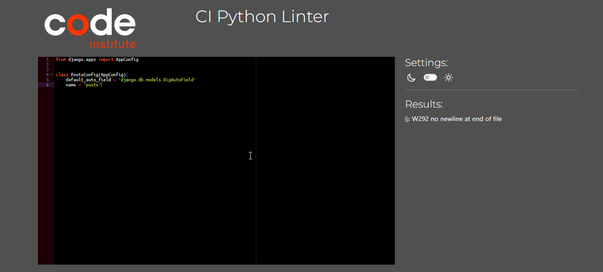

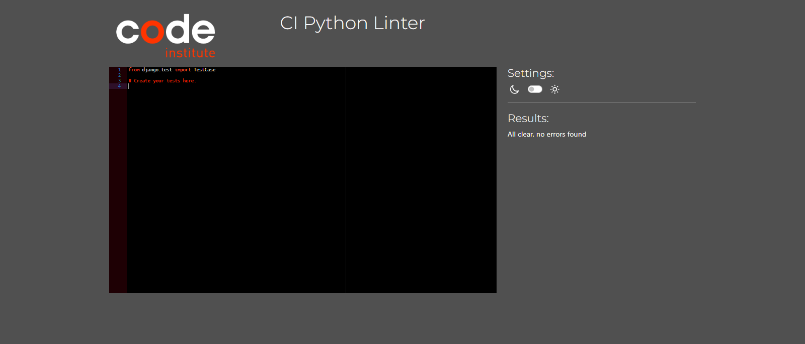

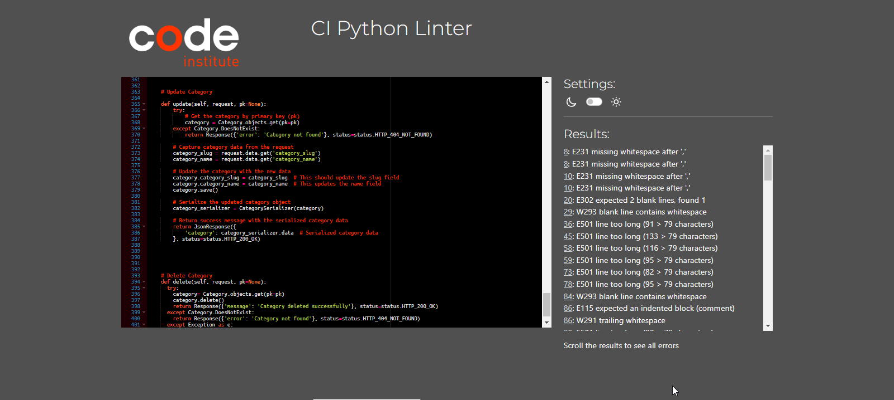

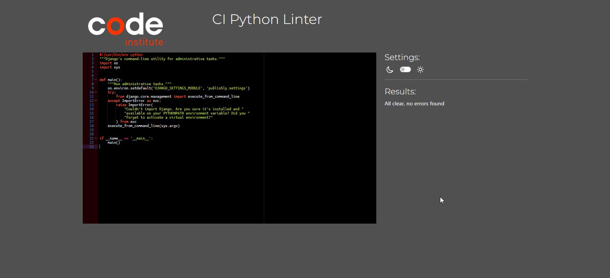

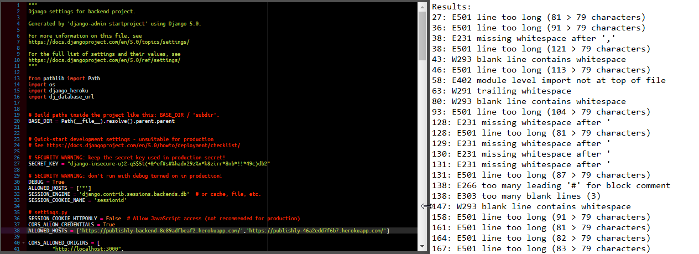

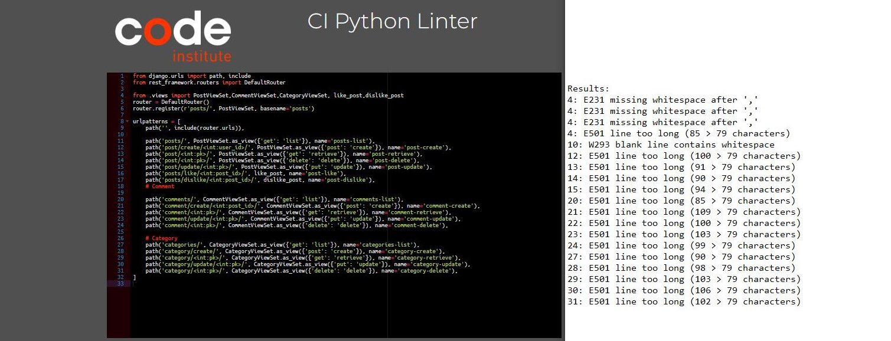

# Test Cases

## User Registration and Login

### Test Case: User Registration

Description: Verify that a new user can register successfully.
Steps: Navigate to the registration page.
Fill in the required fields (Fullname, email, password, etc.).
Submit the registration form.
Verify that the user is redirected to the home page.
Expected Result: User is registered successfully and redirected to the home page.

### Test Case: User Login

Description: Verify that a registered user can log in successfully.
Steps: Navigate to the home page.
Enter valid credentials (username and password).
Submit the login form.
Verify that the user is redirected to home page.
Expected Result: User is logged in successfully and redirected to the home page.

## User Post

### Test Case: Post Creation and Display in User Account
Description:
Verify that a user can successfully create a post by selecting a category, adding comments, and uploading images. Additionally, ensure the user can follow and like other users' content.

Steps:
Log in to the website.
Navigate to the home page.
Utilize the post creation window to publish an idea, including images and selecting a relevant category.
Submit the post.
Verify that the post, along with any images and comments, is displayed on the main feed.
Confirm that the post and associated comments are visible in the user's account under their activity.

Expected Result:
The post, including its category, images, and comments, is successfully published and displayed in the user’s account. Additionally, the user can like and follow other users as intended.

## General Functionality

### Test Case: Responsive Design

Description: Verify that the website is responsive and displays correctly on various devices.
Steps: Open the website on different devices (desktop, tablet, mobile).
Verify that the layout adjusts correctly to the screen size.
Verify that all functionalities work as expected on each device.
Expected Result: Website displays correctly and functions as expected on all devices.

### Test Case: Navigation Links

Description: Verify that all navigation links work correctly.
Steps: Click on each navigation link in the menu.
Verify that the user is redirected to the correct page.
Verify that the content of the page matches the link description.
Expected Result: Navigation links work correctly and redirect to the appropriate pages.

# Deployment Instructions for Publishly web site

## Via Visual Studio

Create a GitHub Repository: Set up a new repository on GitHub for your project.
Set Up Visual Studio Workspace: Open Visual Studio, and clone your GitHub repository to create a local workspace.
Build and Deploy: Use the terminal in Visual Studio to run the necessary commands to build and deploy your website.
Save Your Work: Save your work in the Visual Studio workspace, and use Git commands to add, commit, and push changes to GitHub.
Install Dependencies: Ensure all required modules are listed in the requirements.txt file for smooth deployment.

## Via GitHub

Create a GitHub Account and Repository: Open GitHub, sign in, and create a new repository.
Link Visual Studio Workspace: Use the repository link to set up a workspace in Visual Studio.
Develop and Save: Develop your project in Visual Studio, and use Git commands to save and push your code to GitHub.

## Via Heroku 

Set Up Heroku Account: Sign up for Heroku, selecting appropriate options such as role (e.g., student) and development language (Python).
Create Heroku App: Create a new app on Heroku, configuring necessary settings like app name and region.
Configure Settings and Deploy: Set up config variables and deploy methods. Link to your GitHub repository, and deploy your app either manually or automatically. 
Run and Test: After deployment, start or restart your app to ensure it is running correctly.
Preparing Your Environment
Create a Django Project and App: Set up your Django project and create necessary apps.
Migrate and Test: Run migrations and test the server to ensure everything is set up correctly.
Set Up External Database: Create a new database on ElephantSQL and link it to your project.
Manage Static and Media Files: Use Cloudinary to store static and media files, and configure the settings accordingly.
Finalize and Deploy: Make necessary adjustments in settings, create a Procfile, and deploy your project to Heroku.

# Credits

Django Project: Utilized the Django framework to build the core of the Publishly platform.
W3Schools Django Tutorial: Followed the comprehensive Django tutorial provided by W3Schools for foundational guidance and best practices.
Python.org: Referenced official Python documentation and resources available at Python.org for language-specific details and advanced features.
